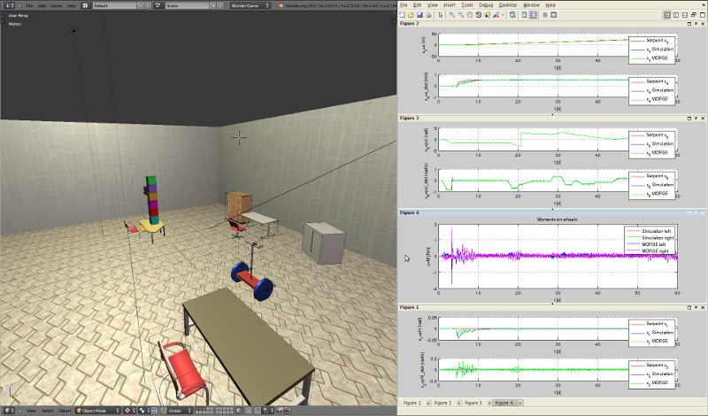

Example: Using MORSE and Matlab for simulation of dynamic systems
==============
This example shows how to connect MORSE and Matlab [#]_ trough :doc:`sockets <../middlewares/socket>` and plot important simulation data.

Example is based on Segway-like robot :doc:`Fuchs <../robots/fuchs>` used by `Intelligent Industrial Robots group (IIROB) <http://rob.ipr.kit.edu/english/303.php>`_ on KIT. 

The purpose is to validate designed model and controller, but also for analysis of dynamic systems.

Matlab part
-----------------
In Matlab is calculated controller for Fuchs based on an dynamic model. System states are roll angle (x1) and velocity (x2), position (x3) and linear velocity (x4), pitch angle (x5) and velocity (x6). Simulation can be done with or without live plot of system states (Files ``$MORSE_DOWNLOAD_DIR/examples/clients/matlab/matlab-scripts/compare_morse_and_simulation[_live_plot].m`` ).

For detailed files explanation see Matlab source files in ``$MORSE_INSTALL_DIR/share/morse/examples/clients/matlab/matlab-scripts/``.

MORSE part
-----------------
In file ``$MORSE_DOWNLOAD_DIR/examples/clients/matlab/matlab_scenario.py`` is morse builder script for this example and Blender file with finished scenario ``$MORSE_DOWNLOAD_DIR/examples/clients/matlab/matlab_scenario.blend``. The robot parts are marked with prefix ``Fuchs_``. They are connected with "Rigid body joint" to simulate dynamic dependence. In "contoller" Python-script where robot controller algorithm can be found. With arrow-keys robot is moved (references are velocities).

Simulation
-----------------
Open in MORSE fuchs_control.blend [#]_ file (in edit mode) and in Matlab ``compare_morse_and_simulation.m`` or ``compare_morse_and_simulation_live_plot.m`` [#]_ regarding desired simulation (with or without live plot of data). Start script in Matlab and wait message "Waiting for MORSE..." then Blender Game Engine has to be started. If is everything OK Matlab writes message "Simulation execution...". Now you can move robot in MORSE with arrow-keys.

NOTE: With arrow-keys provide set points for linear and pitch angle velocity and robot is unstable if changes are big. So please monitor set point and process value in terminal where MORSE is opened or in Matlab graphs.

Default duration of simulation is 60 s (variable simTime in Matlab script).

.. [#] Matlab is registered trademark of `The Mathworks, Inc <http://www.mathworks.com/>`_
.. [#] in ``$MORSE_DOWNLOAD_DIR/examples/clients/matlab/`` folder
.. [#] in ``$MORSE_DOWNLOAD_DIR/examples/clients/matlab/matlab-scripts/`` folder
